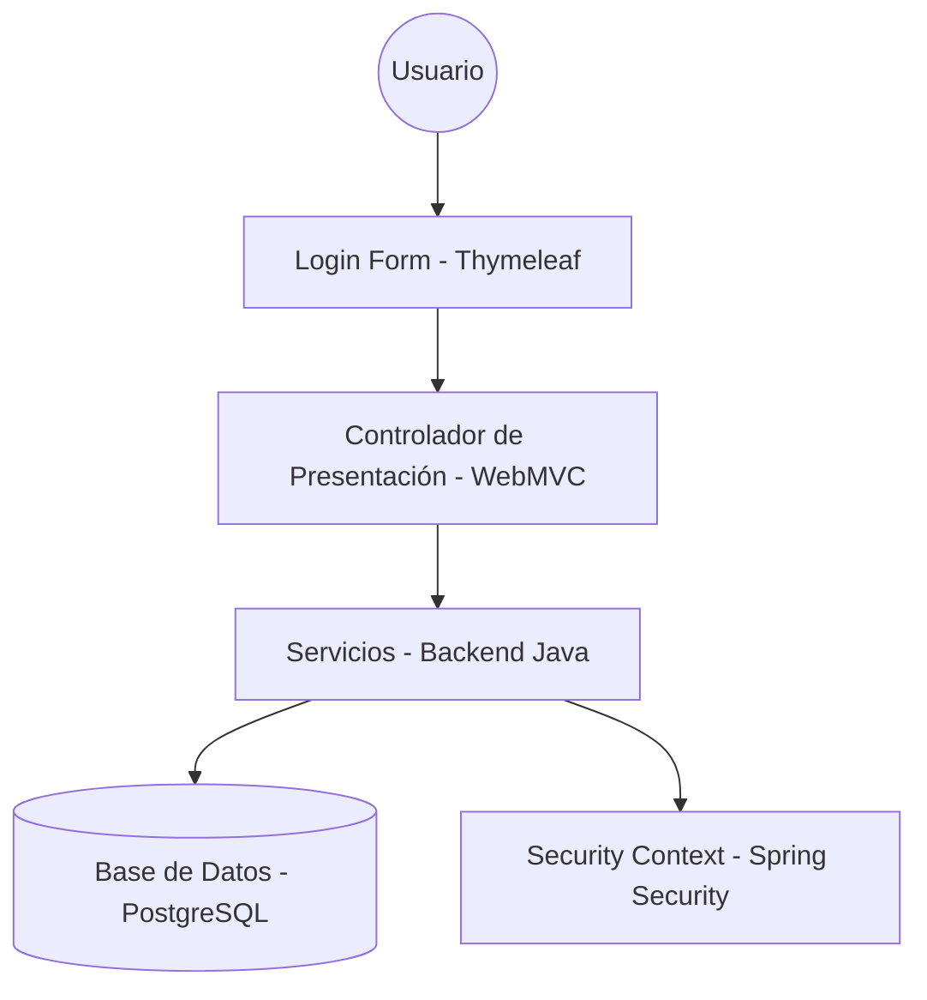

# Arquitectura del Sistema 🏗️

Este documento describe la arquitectura técnica, los principios de diseño y el flujo de datos del proyecto **Academia Roller Speed**.

## 🏗️ Diagrama de Componentes

La arquitectura se fundamenta en el patrón **Model-View-Controller (MVC)** potenciado por Spring Boot y Thymeleaf.

### Capas del Sistema

1.  **Capa de Presentación (Frontend):**
    *   **Thymeleaf Templates:** Renderizado dinámico del lado del servidor.
    *   **Bootstrap 5:** Diseño responsivo y adaptable.
    *   **Static Assets:** JavaScript y CSS servidos desde `src/main/resources/static`.
2.  **Capa de Aplicación (Backend):**
    *   **Controladores (`@Controller`):** Orquestan el flujo de peticiones y respuestas.
    *   **Servicios (`@Service`):** Contienen la lógica de negocio, validaciones y cálculos.
3.  **Capa de Datos:**
    *   **Modelos (`@Entity`):** Mapeo de objetos Java a tablas PostgreSQL.
    *   **Repositorios (`@Repository`):** Consultas personalizadas y operaciones CRUD mediante Spring Data JPA.
4.  **Capa de Seguridad:**
    *   **SecurityConfig:** Configuración centralizada de reglas de acceso, encriptación BCrypt y protección de endpoints por roles (`ADMIN`, `ESTUDIANTE`, `INSTRUCTOR`).

---

## 🏗️ Patrones de Diseño Implementados

### 1. Repository Pattern
Separamos la lógica de acceso a datos de la lógica de negocio utilizando interfaces de repositorios, reduciendo el acoplamiento con Hibernate.

### 2. Service Layer Pattern
Toda la lógica de negocio reside en clases de servicio dedicadas, garantizando que los controladores sean ligeros y enfocados solo en la interacción.

### 3. Server-Side Rendering (SSR)
Aprovechamos Thymeleaf para inyectar datos directamente en el HTML del servidor, simplificando el flujo de estados y reduciendo la complejidad del frontend.

### 4. Dependency Injection
Uso extensivo de Spring's Inversion of Control (IoC) para la modularidad y facilidad de mantenimiento.

---

## 🏗️ Flujo de Autenticación Local

El sistema implementa un flujo de seguridad local robusto:
1.  **Login Tradicional:** Autenticación a través del formulario nativo `/login` usando el correo electrónico y contraseña.
2.  **Manejo de Sesión:** Spring Security gestiona el `SecurityContext` en la sesión del servidor.
3.  **Autorización Basada en Roles:** Acceso restringido a módulos (`/dashboard/admin/**`, `/panel/instructor/**`, `/panel/estudiante/**`) validado mediante roles persistidos en la base de datos.
4.  **Encriptación:** Uso de `BCryptPasswordEncoder` para asegurar las contraseñas en reposo.

---

## 🏗️ Consideraciones Técnicas

-   **Rendimiento:** Optimización de consultas JPA y uso de cargado perezoso (*Lazy Loading*) para relaciones complejas.
-   **Seguridad:** Protección contra ataques comunes como CSRF y fijación de sesión mediante la configuración estándar de Spring Security 6+.
-   **Manejo de Errores:** Controladores que redireccionan a vistas amigables en caso de errores 403, 404 o 500.
