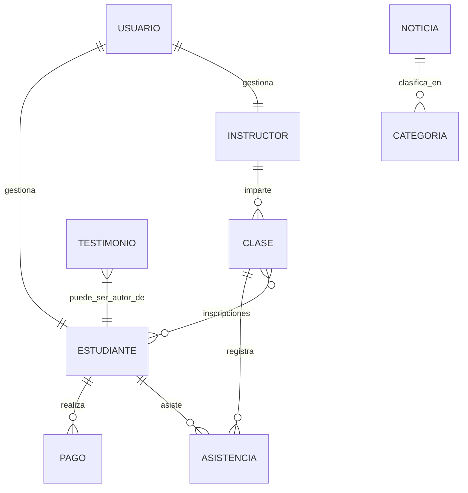

# Configuración y Estructura de Base de Datos 🗄️

Este documento unifica la configuración técnica, el mapeo de entidades y el esquema físico de la base de datos para el proyecto **Academia Roller Speed**.

---

## 1. Configuración de Conexión (PostgreSQL)

La aplicación utiliza **Spring Data JPA** con **Hibernate** para gestionar la persistencia sobre un motor **PostgreSQL**. La configuración se encuentra centralizada en `src/main/resources/application.properties`.

### Parámetros Principales:
-   **URL de Conexión:** Utiliza una cadena JDBC que soporta SSL para entornos de nube como Render:
    `jdbc:postgresql://<host>:5432/<db_name>?sslmode=require`
-   **Dialecto Hibernate:** `org.hibernate.dialect.PostgreSQLDialect`
-   **Estrategia DDL:** `spring.jpa.hibernate.ddl-auto=update` (Genera y actualiza las tablas automáticamente basándose en las entidades Java).
-   **Driver:** `org.postgresql.Driver`

---

## 2. Mapeo de Entidades (Java a SQL)

El sistema utiliza anotaciones JPA (`@Entity`) para transformar los objetos Java en tablas relacionales.

### Entidades Core:
-   **Estudiante (`estudiantes`):** Información de alumnos y estado de pago.
-   **Instructor (`instructores`):** Perfil docente y escalafón salarial.
-   **Clase (`clases`):** Oferta académica con relación N:M hacia estudiantes mediante la tabla **`clase_estudiantes`**.
-   **Usuario (`usuarios`):** Credenciales encriptadas con BCrypt y roles (`ADMIN`, `ESTUDIANTE`, `INSTRUCTOR`).

### Entidades de Contenido (NUEVAS):
-   **Noticia (`noticias`):** Artículos informativos para el portal principal.
-   **Testimonio (`testimonios`):** Reseñas y opiniones de la comunidad.
-   **Evento (`eventos`):** Agenda institucional y actividades programadas.

---

## 3. Esquema Físico SQL (DDL)

A continuación se detalla la estructura de tablas generada para el motor **PostgreSQL**:

```sql
-- Gestión de Acceso
CREATE TABLE usuarios (
    id BIGSERIAL PRIMARY KEY,
    email VARCHAR(255) NOT NULL UNIQUE,
    password VARCHAR(255) NOT NULL,
    rol VARCHAR(50) NOT NULL,
    activo BOOLEAN NOT NULL DEFAULT TRUE
);

-- Perfiles Docentes
CREATE TABLE instructores (
    id BIGSERIAL PRIMARY KEY,
    nombre VARCHAR(255) NOT NULL,
    especialidad VARCHAR(255) NOT NULL,
    salario DECIMAL(10, 2),
    usuario_id BIGINT UNIQUE REFERENCES usuarios(id)
);

-- Perfiles Estudiantiles
CREATE TABLE estudiantes (
    id BIGSERIAL PRIMARY KEY,
    nombre_completo VARCHAR(255) NOT NULL,
    documento_identidad VARCHAR(50) NOT NULL UNIQUE,
    nivel VARCHAR(50) NOT NULL,
    usuario_id BIGINT UNIQUE REFERENCES usuarios(id)
);

-- Control Académico y N:M
CREATE TABLE clases (
    id BIGSERIAL PRIMARY KEY,
    nombre VARCHAR(255) NOT NULL,
    nivel VARCHAR(50) NOT NULL,
    horario VARCHAR(255) NOT NULL,
    instructor_id BIGINT REFERENCES instructores(id)
);

CREATE TABLE clase_estudiantes (
    clase_id BIGINT REFERENCES clases(id),
    estudiante_id BIGINT REFERENCES estudiantes(id),
    PRIMARY KEY (clase_id, estudiante_id)
);

-- CONTENIDO DINÁMICO (MOCKS TRANSICIONADOS)
CREATE TABLE noticias (
    id BIGSERIAL PRIMARY KEY,
    titulo VARCHAR(255) NOT NULL,
    contenido TEXT NOT NULL,
    fecha_publicacion DATE DEFAULT CURRENT_DATE,
    imagen_url VARCHAR(255),
    categoria VARCHAR(50)
);

CREATE TABLE testimonios (
    id BIGSERIAL PRIMARY KEY,
    autor VARCHAR(100) NOT NULL,
    rol_autor VARCHAR(50), -- Madre de Familia, Alumno, etc.
    contenido TEXT NOT NULL,
    estrellas INTEGER CHECK (estrellas >= 1 AND estrellas <= 5)
);

CREATE TABLE eventos (
    id BIGSERIAL PRIMARY KEY,
    nombre_evento VARCHAR(255) NOT NULL,
    fecha_evento DATE NOT NULL,
    ubicacion VARCHAR(255),
    descripcion TEXT
);

-- Seguimiento y Finanzas
CREATE TABLE asistencias (
    id BIGSERIAL PRIMARY KEY,
    fecha DATE NOT NULL,
    presente BOOLEAN NOT NULL,
    clase_id BIGINT REFERENCES clases(id),
    estudiante_id BIGINT REFERENCES estudiantes(id)
);

CREATE TABLE pagos (
    id BIGSERIAL PRIMARY KEY,
    monto DECIMAL(10, 2) NOT NULL,
    fecha_pago DATE NOT NULL,
    estado VARCHAR(50) NOT NULL,
    estudiante_id BIGINT REFERENCES estudiantes(id)
);
```

---

## 4. Diagrama de Relaciones Actualizado



---

## 5. Consideraciones de Rendimiento
-   **Índices:** Se han configurado índices únicos en `documento_identidad` y `email`.
-   **Carga Perezosa (Lazy):** Las relaciones complejas como `estudiantes` dentro de `Clase` utilizan `FetchType.LAZY`.
-   **Contenido:** Las tablas de `noticias`, `testimonios` y `eventos` permiten desacoplar el frontend del código fuente, permitiendo actualizaciones desde el panel administrativo en el futuro.
