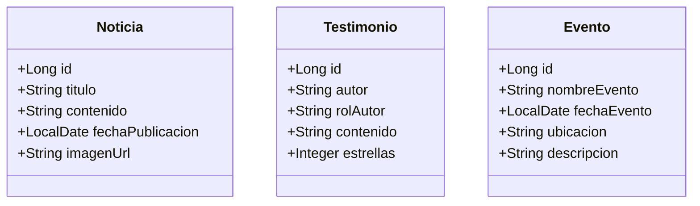

# Modelo de Datos de Contenido Dinámico 📰

Este documento describe la estructura de las tablas creadas para transicionar el contenido estático del portal a un modelo gestionado por base de datos.

---

## 1. Tabla: `noticias`
Almacena comunicados, logros y novedades de la academia.

| Columna | Tipo de Dato | Restricción |
| :--- | :--- | :--- |
| **id** | BIGSERIAL | PRIMARY KEY |
| **titulo** | VARCHAR(255) | NOT NULL |
| **contenido** | TEXT | NOT NULL |
| **fecha_publicacion** | DATE | DEFAULT CURRENT_DATE |
| **imagen_url** | VARCHAR(255) | Opcional |
| **categoria** | VARCHAR(50) | Opcional |

---

## 2. Tabla: `testimonios`
Almacena reseñas y opiniones de padres de familia y alumnos.

| Columna | Tipo de Dato | Restricción |
| :--- | :--- | :--- |
| **id** | BIGSERIAL | PRIMARY KEY |
| **autor** | VARCHAR(100) | NOT NULL |
| **rol_autor** | VARCHAR(50) | Ej. "Madre de Familia" |
| **contenido** | TEXT | NOT NULL |
| **estrellas** | INTEGER | CHECK (1 - 5) |

---

## 3. Tabla: `eventos`
Almacena la agenda de actividades deportivas y competitivas.

| Columna | Tipo de Dato | Restricción |
| :--- | :--- | :--- |
| **id** | BIGSERIAL | PRIMARY KEY |
| **nombre_evento** | VARCHAR(255) | NOT NULL |
| **fecha_evento** | DATE | NOT NULL |
| **ubicacion** | VARCHAR(255) | Opcional |
| **descripcion** | TEXT | Opcional |

---

## 🧱 Implementación en Java (JPA)

> [!TIP]
> Estas entidades han sido creadas con sus respectivos **Repositorios JPA**, permitiendo que el sistema sea 100% dinámico antes de salir a producción.
